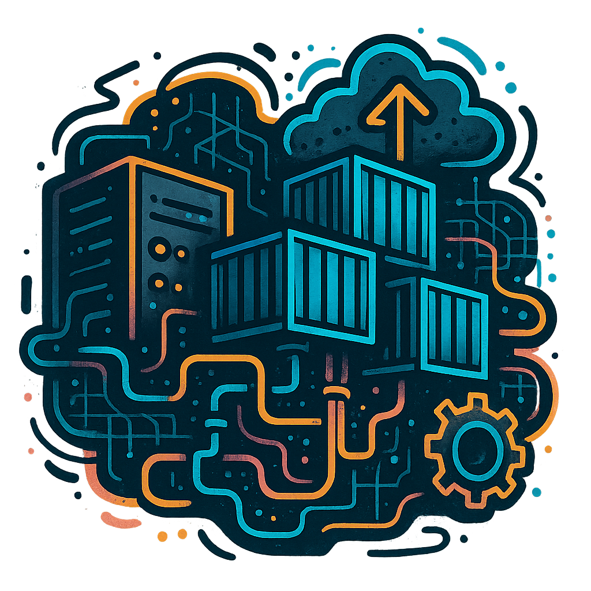

# Inception-of-Things (IoT)

  

## Overview

Welcome to **Inception-of-Things**, a hands-on system administration project where we explored the world of **Kubernetes**, **DevOps**, and **infrastructure automation**.  
Through this project, we went from spinning up virtual machines to deploying real applications with continuous delivery pipelines, all powered by industry-standard tools.

## What This Project Covers

Throughout this project, we:
- Built and managed lightweight Kubernetes clusters with **K3s**.
- Simulated real infrastructure using **Vagrant** and **VirtualBox**.
- Deployed multiple **web applications** using Kubernetes **Ingress** to manage traffic based on hostnames.
- Ran Kubernetes locally with **K3d** for faster iteration and testing.
- Automated deployments using **ArgoCD** and **GitHub** with a GitOps workflow.
- Managed application versions and rolled out updates directly from Git repositories.
- (Optionally) Integrated a local **GitLab** instance to simulate a fully self-hosted DevOps platform.

## 🛠️ Technologies Used

  
Tool for automating the creation and provisioning of virtual machines. Used here to define reproducible development environments for Kubernetes clusters.

  
Open-source virtualization platform. Provided the virtual infrastructure for running isolated Linux machines needed for K3s.

  
Lightweight Kubernetes distribution. Used to deploy, manage, and expose containerized applications on virtual machines with minimal resource usage.

  
Tool for running K3s clusters inside Docker containers. Provided a fast and lightweight alternative to full VM-based clusters for testing GitOps workflows.

  
Kubernetes CLI. Essential for interacting with the Kubernetes API, managing resources, and verifying deployments.

  
GitOps continuous delivery controller. Automated the deployment of applications from Git repositories into Kubernetes clusters.

  
Containerization platform. Used to build, run, and manage container images, including those deployed in K3s and K3d clusters.

  
Source code management and hosting platform. Served as the source of truth for deployment manifests used by ArgoCD.

  
Self-hosted Git platform (Bonus). Provided internal repository management and CI/CD capabilities for fully local DevOps workflows.

## What We Learned

By completing this project, we gained hands-on experience in:
- Kubernetes cluster management and application deployment.
- Infrastructure automation with Vagrant and VirtualBox.
- GitOps practices using ArgoCD and GitHub.
- Continuous delivery and version management of containerized applications.
- End-to-end DevOps workflows, including optional GitLab integration for fully self-hosted environments.

---

If you're curious about Kubernetes, DevOps, or how modern infrastructure works behind the scenes, feel free to explore the repository or reach out to discuss it further!